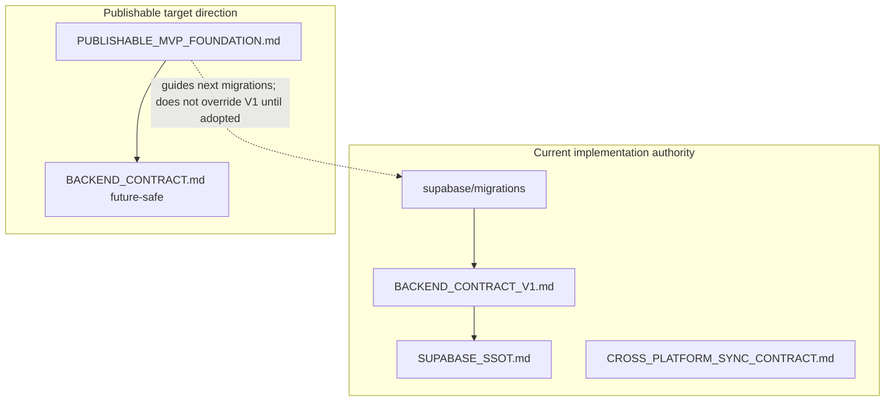

# Publishable MVP Foundation

**Status:** Strategic direction (north star)  
**Last updated:** 05/22/2026  
**Subtitle:** Account/workspace-owned, publishable MVP — **not** current implementation authority.

This document captures a deliberate product and architecture shift: from the fastest path for personal use to a **minimum publishable product foundation**. It guides future migrations and implementation. It does **not** override what the repo does today until those changes are adopted in migrations and V1 contract updates.

---

## 1. Executive summary

The MVP priority is shifting from **“fastest path for Joe’s workflow”** to **“minimum publishable product foundation.”**

That does **not** mean building full SaaS now. It means the MVP should include the parts that are painful to retrofit later:

- Auth / account boundary
- Workspace-owned data
- Secure RLS policies
- Storage paths scoped by workspace
- Sync and deletion model
- Basic billing / entitlement **shape** (not full billing)
- App Store review readiness (planned early, delivered incrementally)

**Direction change:**

```text
Build a publishable single-user workspace app first.
Do not build a local-only personal tool first.
```

**Platform rules for MVP:**

| Topic | Rule |
| --- | --- |
| Accounts | Yes — real account boundary from the start |
| `workspace_id` | Yes — on all synced business rows |
| RLS | Yes — required for MVP, not “later” |
| Storage | Workspace-scoped paths |
| Sync / deletes | Tombstone-first for synced records; hard purge later |
| Team / billing | Deferred — single-user workspace and `plan = beta` are enough |

**Capture vs shared data:**

- iPhone **unsubmitted** capture queue stays **local-first** until Submit.
- **After Submit**, items, photos, metadata, and status belong to the remote **workspace** and sync across iPhone and desktop.

---

## 2. Document authority hierarchy



| Layer | Role |
| --- | --- |
| **Today** | [`supabase/migrations/`](../supabase/migrations/), [`BACKEND_CONTRACT_V1.md`](BACKEND_CONTRACT_V1.md), [`SUPABASE_SSOT.md`](SUPABASE_SSOT.md) describe what the repo **does now** |
| **This doc** | Describes what we are **building toward** for publishable release |
| **Conflict rule** | Where they disagree (shared account, permissive RLS, store-scoped storage paths, hard-delete-first cleanup), **this doc wins for future work**; V1 docs remain accurate for **current code** until migrated |

**Normative read order when planning publishable work:**

1. This doc (target)
2. [`SUPABASE_SSOT.md`](SUPABASE_SSOT.md) (ownership layers — still valid; workspace extends it)
3. [`BACKEND_CONTRACT_V1.md`](BACKEND_CONTRACT_V1.md) (current handoff contract)
4. [`CROSS_PLATFORM_SYNC_CONTRACT.md`](CROSS_PLATFORM_SYNC_CONTRACT.md) (sync behavior — update when workspace sync lands)
5. [`ios-migration-docs/.../BACKEND_CONTRACT.md`](ios-migration-docs/ebay-photo-app-ios-migration-docs/docs/BACKEND_CONTRACT.md) (future-safe reference)

---

## 3. Publishable MVP definition

A seller can create or sign into an account, capture item photos on iPhone, submit them to their workspace, open the desktop lister, see the same items, edit listing metadata and status, delete or archive submitted items safely, and trust that their data belongs only to their account.

That is publishable — not necessarily feature-complete, but **real**.

### Acceptance criteria

- [ ] User signs in (Supabase Auth; email OTP acceptable for MVP)
- [ ] Default workspace, store, and batch created on first sign-in
- [ ] iPhone captures locally; Submit uploads to **their** workspace only
- [ ] Desktop lister shows submitted items for that workspace only
- [ ] Listing status and metadata edits persist remotely and sync back
- [ ] Delete/archive of submitted items uses tombstones; other devices do not resurrect deleted rows
- [ ] RLS prevents cross-account access to rows and storage objects
- [ ] Demo account or seeded demo workspace exists for App Store review (Phase 5)
- [ ] In-app account deletion path before App Store submission if the app supports account creation (Phase 5)

---

## 4. Foundations required before more lister polish

These are **platform foundations**. Deprioritize camera UI polish, batch/store delete UI, and advanced lister features until these exist.

### 4.1 Real account + workspace model

Minimum schema direction:

```sql
profiles
workspaces
workspace_members

stores
batches
items
photos
photo_variants
devices          -- optional in MVP
sync_state       -- optional in MVP
sync_events      -- optional in MVP
```

Every synced business row should eventually include:

```sql
workspace_id
created_at
updated_at
deleted_at
created_by
updated_by
deleted_by
```

**MVP default:** one workspace per user (no team invites yet).

```text
User signs up
  → default workspace created
  → default store created
  → default batch created
```

### 4.2 Row Level Security now, not later

Do not rely on “we’ll secure it later” for a product intended for paying users.

Enforce:

```text
A signed-in user can only access rows for workspaces they belong to.
```

Minimum RLS pattern:

```sql
-- Conceptual: membership check on workspace_id
workspace_members.user_id = auth.uid()
```

Apply to all exposed tables and to `storage.objects` policies.

References: [Supabase RLS](https://supabase.com/docs/guides/database/postgres/row-level-security), [Storage access control](https://supabase.com/docs/guides/storage/security/access-control).

### 4.3 Workspace-scoped storage paths

Photo files must not live under store-only paths long term.

**Target path:**

```text
workspaces/{workspaceId}/stores/{storeId}/batches/{batchId}/items/{itemId}/photos/{photoId}/{variant}.jpg
```

Storage RLS must match table RLS: only workspace members can read/write/delete objects under their workspace prefix.

**Current V1 path (until migrated):**

```text
{storeId}/batches/{batchId}/items/{itemId}/photos/{photoId}/{variant}
```

See [`BACKEND_CONTRACT_V1.md`](BACKEND_CONTRACT_V1.md).

### 4.4 Sync as a first-class MVP requirement

Users expect:

```text
capture on iPhone → see on desktop → edit/delete/list on desktop → changes reflect on iPhone later
```

**MVP sync rule:**

```text
Submitted workspace data syncs.
Unsubmitted iPhone capture queue stays local-first.
```

**Baseline:** workspace snapshot or cursor polling (correctness first).  
**Optional later:** Supabase Realtime for poke/hints — be aware of delete-event and scaling limitations ([Postgres Changes](https://supabase.com/docs/guides/realtime/postgres-changes)).

### 4.5 Tombstone-first delete

Default delete for synced records must **not** be immediate hard delete.

Use:

```sql
deleted_at
deleted_by
deleted_reason   -- optional
```

Hide deleted records in normal UI. Hard purge (storage objects + row removal) runs later via cleanup jobs.

This avoids:

```text
Device A deletes item.
Device B was offline.
Device B comes online and resurrects stale local data.
```

Hard-delete mechanics (storage key removal, cascade deletes) remain useful for **purge**, not default user delete.

**Hard-purge eligibility:** Do not hard-purge tombstones until the tombstone has been retained long enough for stale/offline clients to sync, or until the sync model can prove the deletion will not be resurrected. Phase 3 (sync correctness) is a prerequisite gate for enabling automated hard purge in production.

Failure mode if purge runs too early:

```text
Device A deletes item (tombstone set).
Device B is offline longer than the purge window.
Server hard-purges the tombstone and storage.
Device B comes online with stale local cache and may resurrect or diverge.
```

### 4.6 Billing shape (deferred implementation)

Do **not** ship full subscriptions before the app is useful. Do create room for:

```sql
workspace_entitlements
workspace_plan
subscription_status
stripe_customer_id   -- nullable
```

Near-term:

```text
plan = beta
features enabled manually
Stripe / App Store billing integration deferred
```

When billing becomes implementation work, **native iOS monetization must be reviewed separately** from Stripe alone. In-app purchase requirements can apply depending on what is sold and where; do not assume a web/Stripe subscription path satisfies the iOS app without an explicit product decision ([App Review Guidelines](https://developer.apple.com/app-store/review/guidelines/)).

Reference: [Stripe subscriptions overview](https://docs.stripe.com/billing/subscriptions/overview).

### 4.7 App Store review readiness (planned early)

If the app has account-based features, Apple expects a demo account or fully featured demo mode, and backend services must be live during review ([App Review Guidelines](https://developer.apple.com/app-store/review/guidelines/)).

Plan for:

- Demo account / seeded demo workspace
- Stable production backend environment
- Privacy policy URL
- Support URL
- **Account deletion path before App Store submission** if the app supports account creation (in-app request/path required by App Review; full automated data purge can still be phased, but the user-facing deletion flow must exist)

---

## 5. What stays deferred (explicit non-goals)

- Team invitations and multi-user workspaces
- Complex roles beyond workspace member
- Full billing portal / Stripe or IAP checkout
- eBay API automation / browser extension
- AI listing generation
- Cloud backup of unsubmitted iPhone drafts
- Advanced camera UI (e.g. right/left-hand mode) beyond usability fixes
- Batch/store delete UI polish **before** workspace + tombstone foundation
- Broad UI redesign of lister

These are product improvements. Account, workspace, sync, security, and tombstone deletes are **platform** work.

---

## 6. Current repo reality (audit snapshot)

Factual snapshot of **today** vs **publishable target**. Implementation surfaces are called out for agents and implementers.

| Area | Current state | Publishable target |
| --- | --- | --- |
| **Ownership** | Docs and RLS: any authenticated user can manage all rows (`"Authenticated users can manage stores"` etc. in [`supabase/migrations/20260518000000_initial_phase1_schema.sql`](../supabase/migrations/20260518000000_initial_phase1_schema.sql)) | Workspace membership check on every table |
| **`workspace_id`** | Not on `stores`, `batches`, `items`, `photos` | Required on all synced business rows |
| **Storage path** | `{storeId}/batches/...` per V1 contract | `workspaces/{workspaceId}/stores/...` |
| **Delete** | `remote_deleted_at` on photos/variants for retention cleanup; no entity-level `deleted_at` on items/stores | Tombstone on items/batches/stores; hard purge as async cleanup |
| **Desktop** | IndexedDB bridge + import per [`SUPABASE_SSOT.md`](SUPABASE_SSOT.md) | Same bridge acceptable; import must filter `deleted_at` and never resurrect tombstones |
| **Auth** | Supabase OTP exists | Auto-create default workspace + store + batch on signup |
| **V1 docs** | “One shared account”; owner-scoped RLS deferred ([`BACKEND_CONTRACT_V1.md`](BACKEND_CONTRACT_V1.md), migration package index) | Single-user **workspace** per account; RLS required |

### Key implementation surfaces (today)

| Surface | Path | Notes |
| --- | --- | --- |
| Desktop lister (primary UI) | [`src/phase1/DesktopListerPrototype.tsx`](../src/phase1/DesktopListerPrototype.tsx) | No delete UX on item cards yet |
| Legacy workspace | Retired legacy `Phase1Screen` runtime surface | Dev-only hard delete handlers were a useful reference for **purge** mechanics before retirement |
| Remote import | [`src/adapters/remoteImport.ts`](../src/adapters/remoteImport.ts) | Must gain tombstone filtering |
| Remote cleanup | [`src/adapters/remoteCleanup.ts`](../src/adapters/remoteCleanup.ts) | Retention / `remote_deleted_at` on photos |
| Local stores | [`src/adapters/workflowStore.ts`](../src/adapters/workflowStore.ts), [`src/adapters/itemPacket.ts`](../src/adapters/itemPacket.ts) | `ensureDefaultStore()` pattern for min-one-store |
| iOS submit | `ios/EbayPhotoApp/` | Local queue until Submit |

---

## 7. Target data model (MVP minimum)

Documentation sketch only — not a migration.

### 7.1 New tables

```sql
-- profiles: 1:1 with auth.users
profiles (
  id uuid primary key references auth.users(id),
  display_name text,
  created_at timestamptz,
  updated_at timestamptz
)

workspaces (
  id uuid primary key,
  name text not null,
  created_at timestamptz,
  updated_at timestamptz
)

workspace_members (
  workspace_id uuid references workspaces(id),
  user_id uuid references auth.users(id),
  role text default 'owner',  -- MVP: owner only
  primary key (workspace_id, user_id)
)

-- Optional later
workspace_entitlements (
  workspace_id uuid primary key references workspaces(id),
  plan text not null default 'beta',
  subscription_status text,
  stripe_customer_id text
)
```

### 7.2 Extend existing graph

Add to `stores`, `batches`, `items`, `photos`, `photo_variants` (and future sync tables):

```sql
workspace_id uuid not null references workspaces(id)
deleted_at timestamptz
created_by uuid
updated_by uuid
deleted_by uuid
```

Graph remains:

```text
workspaces → stores → batches → items → photos → photo_variants
```

### 7.3 Store invariant

At least **one store per workspace** always.

- If the user deletes their last store, recreate a **default store** (same idea as `ensureDefaultStore()` in local workflow store).
- Deleting a store tombstones it (or marks deleted); purge job removes children later.

### 7.4 Onboarding

```text
User signs up
  → profile row (trigger or app)
  → default workspace ("My workspace")
  → workspace_members (user as owner)
  → default store
  → default batch (active)
```

---

## 8. Delete model

Two layers — reconcile with earlier “hard delete for dev clutter” discussion.

| Layer | Who triggers | Behavior |
| --- | --- | --- |
| **User-facing delete (synced)** | User in lister or (later) iOS | Set `deleted_at`, `deleted_by`; hide in UI; sync to all clients |
| **Hard purge (system)** | Cleanup job / admin / dev tools | Remove storage objects and rows after retention or explicit purge |

### Scopes (unchanged intent, different mechanism)

| Scope | Effect |
| --- | --- |
| **Delete item** | Tombstone item; hide photos in UI; purge job removes files later |
| **Delete batch** | Tombstone batch and contained items (or cascade tombstone) |
| **Delete store** | Tombstone store; enforce min-one-store; purge later |

### Why tombstone-first

Offline or stale IndexedDB copies must not re-import deleted rows. Import and sync paths must:

```sql
WHERE deleted_at IS NULL
```

and must not upsert local rows over a remote tombstone without an explicit conflict policy.

### Hard purge reuse

Patterns in [`remoteCleanup.ts`](../src/adapters/remoteCleanup.ts) and the retired legacy workspace hard-delete handlers are appropriate for **purge jobs**, not default product delete.

### Hard purge eligibility (sync safety)

Do not hard-purge tombstones until:

1. The tombstone has been retained long enough for stale/offline clients to observe the delete via sync, **or**
2. The sync model can prove the deletion will not be resurrected (see Phase 3).

Tie purge job configuration (minimum tombstone age, retention window) directly to Phase 3 acceptance tests. Automated hard purge in production should not ship before sync correctness is proven.

---

## 9. Sync rules (MVP)

```text
Submitted workspace data syncs.
Unsubmitted iPhone capture queue stays local-first.
```

### Baseline (correctness)

- Fetch workspace snapshot or changes since cursor (`updated_at` / sync version).
- Filter `deleted_at IS NULL` for normal UI and import.
- Merge remote into local IndexedDB cache without resurrecting tombstones.

### Realtime (optional)

- May poke clients to poll sooner.
- Do not rely on Realtime alone for delete propagation ([limitations](https://supabase.com/docs/guides/realtime/postgres-changes)).

### Rules

1. Never re-import tombstoned rows into the local working cache.
2. Local-only drafts (no `remoteId`) are deleted locally only.
3. Desktop remains listing/workspace authority for submitted data ([`CROSS_PLATFORM_SYNC_CONTRACT.md`](CROSS_PLATFORM_SYNC_CONTRACT.md) — update when workspace sync ships).

---

## 10. Staged implementation phases

### Phase 0 — Stop and realign docs

**Deliverables:**

- This document (done when merged).
- When implementation starts: targeted updates to [`BACKEND_CONTRACT_V1.md`](BACKEND_CONTRACT_V1.md) and sync contract — not a bulk rewrite of all specs.

**Statements to adopt in future doc edits:**

```text
MVP targets eventual public release.
Remote submitted data is workspace-owned.
Single-user workspace is MVP default.
RLS/security is required, not future-only.
Local iPhone queue remains local-first before Submit.
Submitted items sync across iPhone + desktop.
Deletes use tombstones first.
```

### Phase 1 — Workspace / account foundation

- `profiles`, `workspaces`, `workspace_members`
- Default workspace creation on signup
- `workspace_id` on synced tables (nullable → backfill → NOT NULL)
- RLS policies on all business tables
- Workspace-scoped storage bucket paths + storage RLS

### Phase 2 — Migrate current upload and desktop lister

- iOS upload and desktop import use `workspace_id`
- No new product features — make existing flow account-safe
- Storage path migration strategy (dual-write or one-time backfill)

### Phase 3 — Sync correctness

- Workspace snapshot / cursor poll
- Filter tombstones on import
- Prove offline device does not resurrect deleted items
- Define minimum tombstone retention / sync window before any automated hard purge is allowed

### Phase 4 — Tombstone item delete

- User delete sets `deleted_at` remotely
- Hide in UI on all clients
- Defer storage hard purge to cleanup job (purge jobs gated by Phase 3 sync-safety rules)

### Phase 5 — Publish-readiness pass

- Demo account / demo workspace seed
- Privacy policy, support link
- Basic onboarding copy
- Production env checks
- In-app account deletion path (required before App Store submission if account creation is supported)
- App Store review notes

### Phase 6 — Billing / entitlements

- Stripe or App Store subscription path after core loop is valuable (review native iOS IAP requirements before choosing implementation)
- Webhook-driven entitlement updates

---

## 11. Relationship to lister and delete UI work

**Do not prioritize** batch/store delete UI or spreading dev hard-delete from the retired legacy workspace into [`DesktopListerPrototype.tsx`](../src/phase1/DesktopListerPrototype.tsx) **until Phases 1–4** are in place.

When delete UX is built:

- Default: tombstone API (set `deleted_at`).
- Purge: background job or explicit admin/dev tool.
- Confirm destructive actions; enforce min-one-store on store delete.

---

## 12. References

### In-repo

- [`SUPABASE_SSOT.md`](SUPABASE_SSOT.md) — three-layer ownership; handoff rules
- [`BACKEND_CONTRACT_V1.md`](BACKEND_CONTRACT_V1.md) — current submit/import contract
- [`CROSS_PLATFORM_SYNC_CONTRACT.md`](CROSS_PLATFORM_SYNC_CONTRACT.md) — sync tiers and field ownership
- [`SUPABASE_SETUP.md`](SUPABASE_SETUP.md) — project setup
- [`ios-migration-docs/.../BACKEND_CONTRACT.md`](ios-migration-docs/ebay-photo-app-ios-migration-docs/docs/BACKEND_CONTRACT.md) — future-safe backend target
- [`ios-migration-docs/.../DOC_INDEX.md`](ios-migration-docs/ebay-photo-app-ios-migration-docs/docs/DOC_INDEX.md) — migration doc index (still reflects pre-workspace V1 snapshot)

### External

- [Supabase Row Level Security](https://supabase.com/docs/guides/database/postgres/row-level-security)
- [Supabase Storage access control](https://supabase.com/docs/guides/storage/security/access-control)
- [Supabase Realtime Postgres changes](https://supabase.com/docs/guides/realtime/postgres-changes)
- [Stripe billing subscriptions overview](https://docs.stripe.com/billing/subscriptions/overview)
- [Apple App Review Guidelines](https://developer.apple.com/app-store/review/guidelines/)

---

## Appendix A — Implementation audit prompt

Use this prompt for gap analysis before coding. Do not treat it as permission to implement without an explicit task.

```md
We need to realign the MVP toward a publishable account-based app, not just the fastest personal-use path.

Do not implement broad features yet. First audit and plan.

Current product direction:
- MVP should be publishable soon.
- Submitted/shared data must be account/workspace-owned.
- Single-user workspace is acceptable for MVP.
- Team accounts/invites/roles are deferred.
- iPhone unsubmitted capture queue remains local-first until Submit.
- After Submit, items/photos/metadata/status belong to the remote workspace and sync across iPhone + desktop.
- Delete should be tombstone-first for synced records, with hard purge/cleanup later.
- RLS/security is required for MVP, not future-only.
- Storage paths should be workspace-scoped.
- Billing can be deferred, but the schema should not block future entitlements.

Task:
1. Inspect current docs, migrations, Supabase schema, storage paths, iOS upload flow, and DesktopListerPrototype data flow.
2. Report where the repo currently assumes single shared account/local personal use.
3. Report what must change to support a publishable single-user workspace MVP.
4. Propose the smallest staged implementation plan.
5. Do not edit code yet unless explicitly asked.

Focus areas:
- auth/profile/workspace creation
- workspace_members table
- workspace_id on stores/batches/items/photos/photo_variants
- RLS policies
- workspace-scoped storage object paths
- submitted-item sync model
- deleted_at tombstone model
- App Store review/demo account implications

Do not propose:
- team invitations
- complex roles
- full billing implementation
- AI listing generation
- eBay API automation
- right/left hand camera mode
- broad UI redesign

Return:
- current state
- gaps
- recommended target MVP architecture
- migration risks
- smallest first implementation slice
```

Canonical strategic doc: [`PUBLISHABLE_MVP_FOUNDATION.md`](PUBLISHABLE_MVP_FOUNDATION.md).
